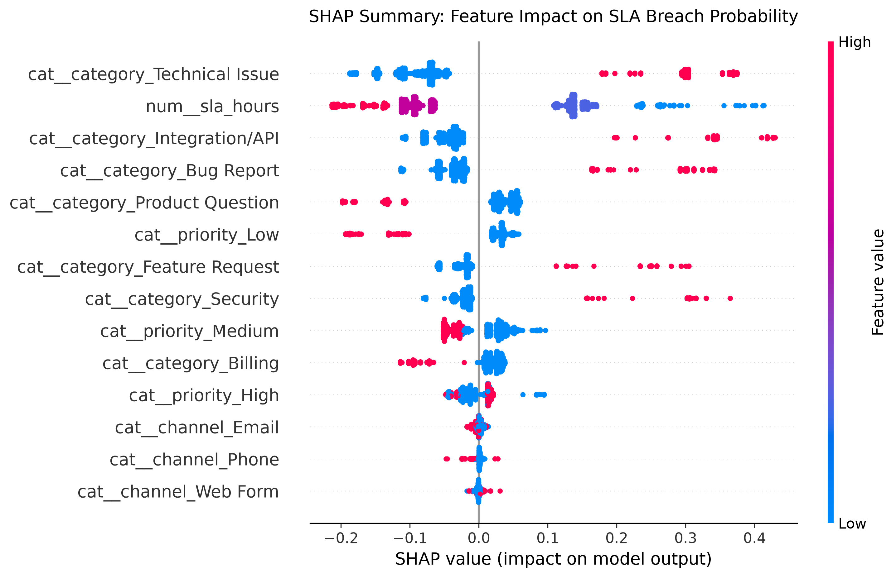
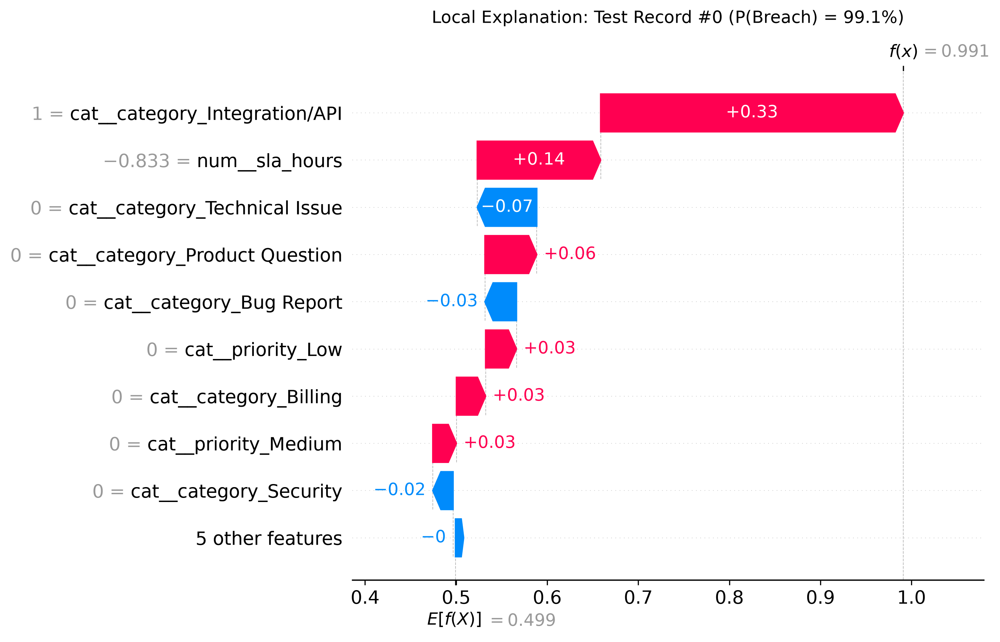

# 🚨 NovaTech AI Bottleneck: SLA Breach Prediction

[](https://www.python.org/)
[](https://pytorch.org/)
[](LICENSE)

## 📖 Executive Summary
Production-oriented Machine Learning and Deep Learning system designed to predict SLA breach risk and estimate ticket resolution times at intake (T=0), eliminating operational bottlenecks through Explainable AI (XAI).

This project transitions support operations from static retrospective indexes to **predictive real-time triage**:
- **Leakage-Free Intake Prediction:** Classifies whether an incoming ticket will breach its SLA using only variables observable at ticket arrival (`sla_hours`, `category`, `priority`, `channel`).
- **Multi-Task Deep Learning:** Employs a custom PyTorch dual-head architecture to simultaneously predict binary SLA breach and continuous resolution hours.
- **Explainable AI (XAI):** Generates global and local feature attribution maps (SHAP Beeswarm and Waterfall plots) to provide transparent decision support for support supervisors.
- **Engineering Standards:** Built with object-oriented data pipelines, automated Pytest suites, parameter-driven training scripts, and batch inference services.

**⚠️ Disclaimer: Theoretical Business & Synthetic Data**  
This project is a portfolio demonstration built around a theoretical business scenario ("NovaTech AI Support"). The dataset (`support_tickets.csv`) consists of **synthetically generated data** designed to mimic real-world IT support ticket patterns, including realistic distributions of categories, priorities, resolution times, and intentional temporal leakage patterns.  

---
## 🚀 Quickstart
### 1. Install dependencies: 
pip install -r requirements.txt
### 2. Train the model: 
python scripts/train.py --data data/support_tickets.csv --output outputs/models/intake_baseline
### 3. Run predictions: 
python scripts/predict.py --input data/support_tickets.csv --output outputs/predictions.csv
### 4. Generate explainability reports: 
python src/explainability.py
### Run the test suite: 
python -m pytest test/ -v

## 🏗️ Repository Architecture
```text
novatech-ai-bottleneck/
├── data/
│   ├── support_tickets.csv              # 20,000 synthetic ticket records
│   └── data_dictionary.csv              # Field metadata and schema definitions
├── src/
│   ├── __init__.py
│   ├── data_pipeline.py                 # OOP data pipeline, cleaning & temporal split
│   ├── ml_baseline.py                   # Scikit-Learn dual baseline models
│   ├── dl_multitask.py                  # PyTorch Multi-Task neural network
│   └── explainability.py                # SHAP beeswarm and waterfall visualization
├── scripts/
│   ├── check_leakeage.py                # Diagnostic script for leakage detection 
│   ├── train.py                         # Production CLI training orchestrator
│   └── predict.py                       # Batch scoring & inference service
├── tests/
│   ├── conftest.py                      # Shared pytest fixtures
│   ├── test_data_pipeline.py            # Unit tests for preprocessing & splits
│   └── test_ml_baseline.py              # Unit tests for estimator training & persistence
├── outputs/
│   ├── models/                          # Serialized estimators and preprocessors (.joblib, .pth)
│   └── reports/                         # SHAP plots and evaluation manifests
├── requirements.txt
└── README.md
```

---

## 🔍 Key Achievement: Data Leakage Detection
During development, an initial model achieved a suspicious ROC-AUC of `>0.97`. Investigation revealed that the target variable (`sla_breach`) was synthetically generated as a direct function of `resolution_hours > sla_hours`. Including post-event metrics like `resolution_hours` or `queue_age_hours` constitutes **temporal data leakage**. 

To solve this, I designed a strict **Intake (T=0) Pipeline** that uses *only* features available at the exact moment a ticket is created.

## 📊 Model Comparison & Results

| Model | Scenario | ROC-AUC | F1-Score | R² (Reg) | Production Ready? |
|-------|----------|---------|----------|----------|-------------------|
| **Random Forest** | **Intake (T=0)** | **0.9606** | **0.9095** | **0.6416** | ✅ **YES (Recommended)** |
| PyTorch Multitask | Intake (T=0) | 0.9617 | 0.9047 | 0.5232 | ️ Optional |
| Random Forest | Omniscient (Leaky) | 1.0000 | 1.0000 | N/A | ❌ NO (Post-mortem only) |


*Note: Why Random Forest is recommended: the two Intake-scenario models are close on classification (RF edges out PyTorch on F1; PyTorch edges out RF on AUC by ~0.001), so classification alone doesn't clearly separate them. The deciding factors are on the regression side — RF has meaningfully lower RMSE (32.01 vs. 36.92) and higher explained variance (R² 0.6416 vs. 0.5232) — plus native TreeSHAP support and lower training/inference overhead. The PyTorch model remains useful as a secondary check and for future extension (e.g., embeddings for free-text ticket descriptions).*

---

## 📈 Explainability (SHAP)

Using SHAP (SHapley Additive exPlanations), we identified the key drivers of SLA breaches:

### Global Feature Importance (Summary Plot)

The beeswarm plot below shows how each feature impacts the prediction of SLA breach. Features are ranked by importance (top to bottom). Red dots indicate high feature values, blue dots indicate low values.



**Key insights:**
1. **`cat__category_Technical Issue`** — Highest impact feature, can both increase AND decrease breach probability depending on context.
2. **`num__sla_hours`** — Clear bimodal pattern: tighter SLAs (8h) push toward breach, generous SLAs (72h) push toward no breach.
3. **`cat__category_Integration/API`** — Consistently pushes predictions toward breach (high-risk category).
4. **`cat__channel_*`** — Minimal impact: the intake channel (Email, Phone, Web Form) barely affects breach risk.

### Individual Prediction Explanation (Waterfall Plot)

The waterfall plot below explains a single prediction: a ticket with **99.1% probability of SLA breach**. Red bars push the prediction toward breach, blue bars push it away.



**Breakdown of this specific ticket:**
- **Integration/API category** (+0.33): The largest positive driver — API tickets are inherently high-risk.
- **Low SLA target (8h)** (+0.14): Tight deadline significantly increases breach probability.
- **Not being a Technical Issue** (−0.07): Slight risk reduction.
- **Base probability** (0.499): The model's average prediction before considering this ticket's features.

### Business Value

This explainability layer transforms the model from a "black box" into a **decision-support tool**. Support managers can:
- **Proactively escalate** high-risk tickets at intake time (T=0).
- **Allocate resources** to the categories and SLA tiers that drive most breaches.
- **Explain predictions** to stakeholders with human-readable visualizations.

---

## 🛠️ Tech Stack

Python · PyTorch · scikit-learn · SHAP · pandas · Pytest · joblib

---

## 📌 Scope & Limitations

This is a portfolio project, not a deployed service. Explicitly out of scope for now:

- No CI/CD pipeline or containerization (Docker) yet.
- Trained and evaluated on synthetic data only; real-world ticket distributions would require re-validation.

---

## 🤝 Engineering Approach & AI Collaboration Disclosure

This repository was developed using an **AI-Augmented Engineering** workflow. While generative AI tools (LLMs) supported early boilerplate scaffolding and syntax suggestions, **the core architectural decisions, validation safeguards, and debugging were strictly human-led**:

* **System Architecture:** Designed modular single-responsibility components (SRP), and decoupled batch inference pipelines.
* **Critical Debugging & Auditing:** Manually detected and resolved temporal data leakage, SHAP multidimensional matrix mismatches, and multi-task loss gradient domination.
* **Domain Alignment:** Formulated intake-safe feature boundaries, evaluation criteria, and business actionability derived from local/global feature attributions.

The project demonstrates the ability to accelerate delivery using modern developer tools while maintaining rigorous production-grade software engineering standards.